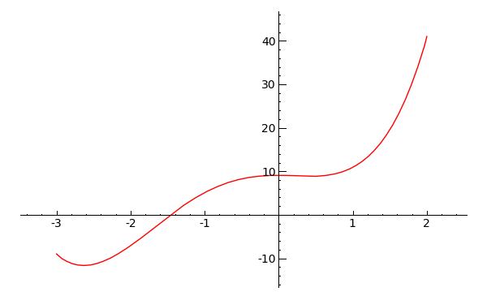

# Polinomios

A nivel elemental, un polinomio es simplemente una expresión algebraica formada con números, letras y operaciones de suma, resta, multiplicación y potenciación.  Sin embargo a un nivel más avanzado debemos indicar, de manera explícita, que tipo de números van a ser los coeficientes y  la letra con la que vamos a trabajar. Nosotros adoptaremos este último punto de vista para extraer todo el potencial de Sage.

En general, de ahora en adelante, los coeficientes serán números racionales o enteros, puesto que el programa trabaja con ellos utilizando aritmética exacta. Para ello, al comienzo del trabajo con Sage debemos escribir lo siguiente (no es necesario entender lo que significa esta instrucción).

`R.<x> = PolynomialRing(QQ)`

En este caso empleamos la letra `x` y  `QQ` es la forma en que Sage denota el cuerpo de los números racionales. Existen otras formas de construir el anillo de polinomios con coeficientes en $\mathbb{Q}$. La siguiente tiene el mismo efecto y es más corta

`R.<x> = QQ[]`


## Operaciones con polinomios

La suma, la resta, la multiplicación y la potenciación se realizan con los operadores habituales. El cociente de la división euclídea se consigue con el operador `//`  y el resto con `%`. El uso de paréntesis es similar al utilizado en matemáticas.

Cada polinomio con coeficientes racionales induce una función real de variable real. Todo lo referente a funciones que veremos en los capítulos siguientes se puede aplicar a los polinomios.

Si trabajamos con polinomios sobre varios cuerpos el método

`.base_ring()`


nos indica sobre que cuerpo (o anillo) está definido el polinomio. La orden

`.parent()`


nos informa prácticamente de lo mismo que la anterior, pero es más completa.


```
sage: R.<x> = QQ[]
sage: # Aunque no es obligatorio es conveniente nombrar los polinomios
sage: f = 3*x^4 + 5*x^3 + 3*x + 2
sage: type(f)
<class 'sage.rings.polynomial.polynomial_element_generic.
Polynomial_rational_dense'>
sage: # Si hemos nombrado al polinomio, evaluarlo se hace como en Matematicas
sage: f(0), f(1), f(89)
(2, 13, 191751837)
sage: g = x^2 - 4*x + 1
sage: f + g
3*x^4 + 5*x^3 + x^2 - x + 3
sage: f - g
3*x^4 + 5*x^3 - x^2 + 7*x + 1
sage: f * g
3*x^6 - 7*x^5 - 17*x^4 + 8*x^3 - 10*x^2 - 5*x + 2
sage: g^3
x^6 - 12*x^5 + 51*x^4 - 88*x^3 + 51*x^2 - 12*x + 1
sage: # Hallamos el cociente
sage: f // g
3*x^2 + 17*x + 65
sage: # Ahora el resto
sage: f % g
246*x - 63
sage: f.base_ring()
Rational Field
sage: f.parent()
Univariate Polynomial Ring in x over Rational Field
```


## Factorización

Decimos que un polinomio $g$ divide a $f$ si al realizar la división euclídea de $f$ entre $g$ el resto es nulo. Es claro que todo polinomio $f$ no nulo es divisible por cualquier constante $k$. Asimismo es divisible por todo polinomio de la forma $kf$, siendo $k$ una constante no nula.  Estos divisores se denominan *triviales*. Si un polinomio posee algún divisor no trivial decimos que es *reducible*. En caso contrario, esto es, si sus únicos divisores son los triviales, decimos que el polinomio es *irreducible*. La cuestión de la irreducibilidad es delicada, pues depende en gran medida del cuerpo base.  Por ejemplo, $x^2 + 1$ es irreducible como polinomio con coeficientes racionales, pero entendido como polinomio con coeficientes complejos es reducible, pues es divisible entre $x-i$. El mismo comentario es válido en la cuestión de la factorización de un polinomio en factores irreducibles.

La comprobación de que un polinomio es irreducible (sobre el cuerpo de definición)

`.is_irreducible()`


 Para factorizar un polinomio (sobre el cuerpo de definición)

`.factor()`


Para obtener el máximo común divisor de dos polinomios (que es independiente del cuerpo base)

`.gcd()`


y para el mínimo común múltiplo

`.lcm()`


```
sage: R.<x> = PolynomialRing(QQ)
sage: f = (x-1)^2 * (x-6)^2 * (x^2 + 1)
sage: g = (x-1)^3 * (x-6) * (3*x - 10)
sage: f.factor()
(x - 6)^2 * (x - 1)^2 * (x^2 + 1)
sage: g.factor()
(3) * (x - 6) * (x - 10/3) * (x - 1)^3
sage: f.gcd(g)
x^3 - 8*x^2 + 13*x - 6
sage: _.factor()
(x - 6) * (x - 1)^2
sage: f.lcm(g)
3*x^8 - 55*x^7 + 378*x^6 - 1240*x^5 + 2185*x^4 - 2493*x^3 + 2170*x^2 -
1308*x + 360
sage: _.factor()
(3) * (x - 10/3) * (x - 6)^2 * (x - 1)^3 * (x^2 + 1)
sage: f.is_irreducible()
False
sage: (x^2 - 2).is_irreducible()
True
sage: # En Q este polinomio es irreducible.  Sobre R es claro que no, 
sage: # pues tiene raices, sqrt(2) y -sqrt(2)
sage: R.<x> = RR[]
sage: f = x^2 - 2
sage: f.is_irreducible()
False
sage: f.factor()
(1.00000000000000*x - 1.41421356237310)*(1.00000000000000*x + 1.41421356237310)
```


## Raíces de polinomios

Cuando hablamos de raíces de un polinomio debemos tener en cuenta en que cuerpo se encuentran las raíces. Por ejemplo, el polinomio $x^2-2$ no tiene raices en $\mathbb{Q}$, pero si que las tiene en $\mathbb{R}$. Por ello existen distintos comandos para hallar las raíces. Si queremos hallar las raíces (con su multiplicidad) que existen en el cuerpo base (en nuestro caso $\mathbb{Q}$)

`.roots()`


Si queremos las raíces reales (calculadas por métodos aproximados)

`.real_roots()`
`

y si queremos las complejas (también por métodos aproximados)

`.complex_roots()`


```
sage: R.<x> = QQ[]
sage: f = (x^2 + 1) * (x - 3)^2 * (x^2 - 2) * (5*x -13)
sage: f.roots()
[(13/5, 1), (3, 2)]
sage: # Tiene la raiz 13/5 simple y la raiz 3 doble. No tiene mas raices en Q
sage: f.real_roots()
[-1.41421356237310,
 1.41421356237310,
 2.60000000000012,
 2.99999974717083,
 3.00000025282904]
sage: # Han aparecido dos soluciones mas, que son las raices cuadradas de 2
sage: # Ademas observamos que la raiz doble 3 ahora son dos soluciones
sage: # muy proximas a 3. Esto es debido a que se trabaja en modo aproximado
sage: f.complex_roots()
[-1.41421356237310,
 1.41421356237310,
 2.60000000000012,
 2.99999974717083,
 3.00000025282904,
 3.06978292612115e-16 + 1.00000000000000*I,
 3.06978292612115e-16 - 1.00000000000000*I]
sage: # Las soluciones complejas, que son i y -i, se dan de modo aproximado
```


## Fracciones algebraicas

Con dos polinomios podemos formar una fracción, que en general no será un polinomio. Las fracciones de polinomios se suelen denominar fracciones algebraicas o también funciones racionales. Sobre ellas se aplican gran parte de los comandos estudiados para polinomios y también para fracciones (númericas).


```
sage: R.<x> = QQ[x]
sage: r = (x^3 - 4)/(3*x^2 - 5*x + 1); s = (6*x^2 - 4*x)/(2*x-5)
sage: r + s
(20*x^4 - 47*x^3 + 26*x^2 - 12*x + 20)/(6*x^3 - 25*x^2 + 27*x - 5)
sage: s^3
(216*x^6 - 432*x^5 + 288*x^4 - 64*x^3)/(8*x^3 - 60*x^2 + 150*x - 125)
sage: r(4), r(-2), r(100)
(60/29, -12/23, 999996/29501)
sage: r.denominator()
3*x^2 - 5*x + 1
sage: r.numerator()
x^3 - 4
sage: type(r)
<class 'sage.rings.fraction_field_element.FractionFieldElement'>
sage: r.base_ring()
Rational Field
sage: r.parent()
Fraction Field of Univariate Polynomial Ring in x over Rational Field
```


## Miscelánea


Muchos de estos comandos pueden parecer inútiles, y ciertamente lo son, si trabajamos con Sage en modo interactivo (esto es, tecleando comandos y esperando la contestación). Sin embargo pueden ser muy útiles cuando se programa en Sage.

El grado de un polinomio

`.degree()`


Para obtener una lista con todos los coeficientes, ordenados de grado menor a grado mayor

`.coeffs()`


Para derivar e integrar polinomios

`.derivative(), .integral()`


La gráfica del polinomio se obtiene con

`.plot()`


Se pueden pasar varias opciones a este último método para mejorar la visualización de la gráfica (ver el capítulo sobre representación gráfica).

```
sage: R.<x> = QQ[x]
sage: f = x^4 + 3*x^3 - 2*x^2 + 9
sage: f.degree()
4
sage: f.coeffs()
[9, 0, -2, 3, 1]
sage: f.derivative()
4*x^3 + 9*x^2 - 4*x
sage: f.integral()
1/5*x^5 + 3/4*x^4 - 2/3*x^3 + 9*x
sage: f.plot()
sage: # Por defecto lo dibuja en el intervalo (0,1) y en color azul
sage: f.plot(-3,2, color = 'red')  
sage: # Ahora se dibuja en el intervalo (-3,2) y en color rojo
```





