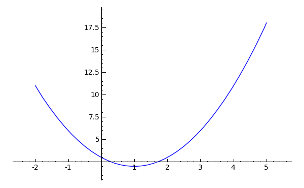
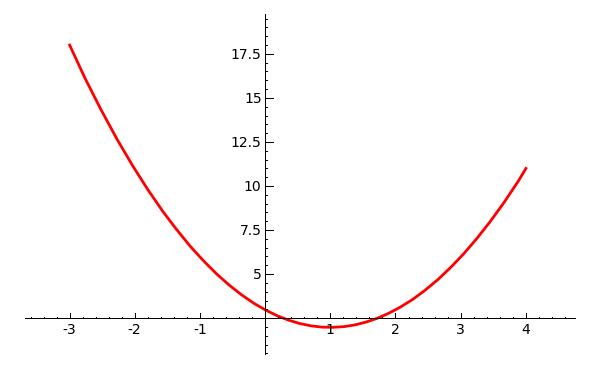
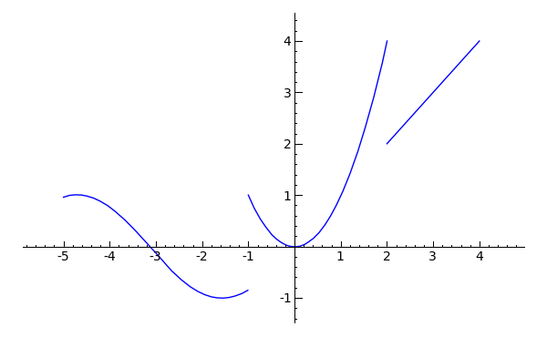
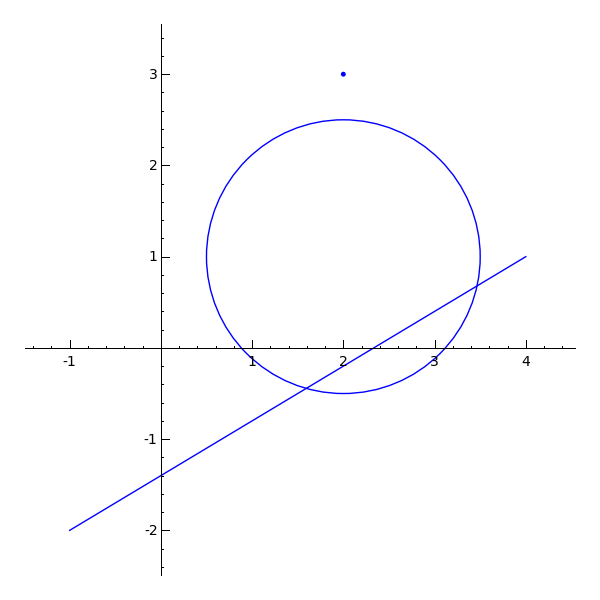

# Gráficas y objetos gráficos

Sage es capaz de realizar gráficas de funciones reales de variable real dadas en  varias formas: explícita (que es la forma habitual de presentar una función), paramétrica, implícita,... Asimismo puede realizar gráficas de funciones de dos variables, cuyo dibujo es una superficie. Analizaremos únicamente el dibujo de las funciones dadas en forma explícita. Además puede realizar el dibujo de ciertos objetos geométricos, como puntos, rectas, circunferencias,...

El formato gráfico por defecto de las imágenes generadas por Sage es *png*, que es un formato libre, de alta calidad y de pequeño tamaño (en bytes).

## Gráficas de funciones

La instrucción básica para representar gráficas de funciones es la orden

`plot(f, xmin, xmax, opciones)`

siendo obligatorio únicamente el primer argumento. Si simplemente escribimos la función entre paréntesis, el programa realizará el dibujo en el intervalo $[-1,1]$. El eje $y$ lo adaptará a la función. Normalmente la escala no será la misma en el eje $x$ y en el eje $y$.


```
sage: f(x) = x^2 -2*x +3
sage: f.plot()
```


Después de la función, podemos añadir, separados por comas, los extremos del intervalo donde queremos dibujar la gráfica.


```
sage: f(x) = x^2 -2*x +3
sage: f.plot(-2,5)  # Dibujo en el intervalo [-2,5]
```



Podemos cambiar el color de gráfica añadiendo la opción `color`. El nombre del color debe figurar entre comillas simples. Existen otras opciones como `thickness` que afecta al grosor de la gráfica. Para ver todas las opciones del comando (y sus valores por defecto) tecleamos `plot.options` (sin paréntesis).


```
sage: f = x^2 - 2*x + 3
sage: plot(f, -3, 4, color = 'red', thickness = 2)
```




## Funciones a trozos y varias funciones

Podemos dibujar varias gráficas en los mismos ejes. Para ello no debemos más que "sumar" las distintas ordenes `plot`.  Con esto podremos "simular" una función definida a trozos, pero en realidad estamos haciendo trampas.


```
plot(sin(x),-5,-1) + plot(x^2,-1,2) + plot(x,2,4)
```


Sin embargo la mejor opción es construir una verdadera función definida a trozos y después representarla. A efectos gráficos no tiene mucha importancia, pero en otros temas si la tendrá.
La orden para definir una función con varios trozos es

`Piecewise()`


```
sage: f = Piecewise([[(-5,-1),sin(x)],[(-1,2),x^2],[(2,4),x]]); f
Piecewise defined function with 3 parts, [[(-5, -1), sin(x)],
[(-1, 2), x^2], [(2, 4), x]]
sage: f.plot()
```




## Diversos objetos gráficos

Los diversos objetos gráficos de esta sección se pueden dibujar directamente con los comandos dados.  Sin embargo los ejes se adaptan al dibujo, lo que conlleva que la apariencia de los dibujos sea muy distinta a la real (una circunferencia parece una elipse, la pendiente de una recta no es la que corresponde,...). Por ello lo mejor es guardar cada uno de los objetos gráficos en una variable y después utilizar el comando `show()` con la opción 
`aspect_ratio = 1` que hace que los ejes tengan la misma escala.

Para dibujar un punto

 `point2d(p)`

donde `p` es un punto.  Para dar las coordenadas de un punto, escribimos ambas entre paréntesis. Además de esto se le pueden añadir varias opciones. Para conocerlas todas (y sus valores por defecto) escribimos `point2d.options` (sin paréntesis)

Para dibujar una recta

`line2d([p,q])`


donde `p` es un punto extremo de la recta y `q` el otro. Ambos puntos deben ir colocados dentro de corchetes. Para ver las opciones se hace lo mismo que en el caso anterior.

Para dibujar una circunferencia

`circle(centro, radio)`


donde `centro` es un punto y `radio` un número positivo.


```
sage: point2d.options
{'alpha': 1, 'faceted': False, 'pointsize': 10, 'rgbcolor': (0, 0, 1)}
sage: line2d.options
{'alpha': 1, 'rgbcolor': (0, 0, 1), 'thickness': 1}
sage: circle.options
{'alpha': 1, 'fill': False, 'rgbcolor': (0, 0, 1), 'thickness': 1}
sage: a = point2d((2,3))
sage: b = line2d([(-1,-2),(4,1)])  # Una linea (o mejor un segmento)
sage: c = circle((2,1), 1.5)
sage: type(a)
<class 'sage.plot.plot.Graphics'>
sage: # El comando show muestra los objetos graficos. La suma de objetos
sage: # graficos significa que los muestra todos
sage: show(a + b + c, aspect_ratio = 1)  # Ejes con la misma escala
```




